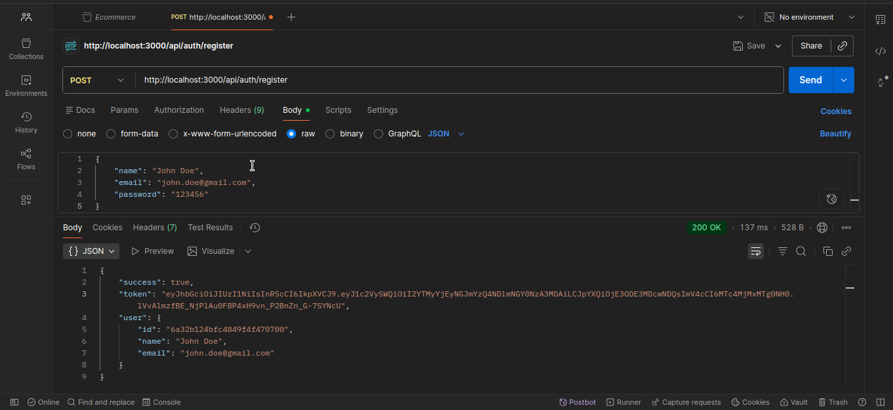
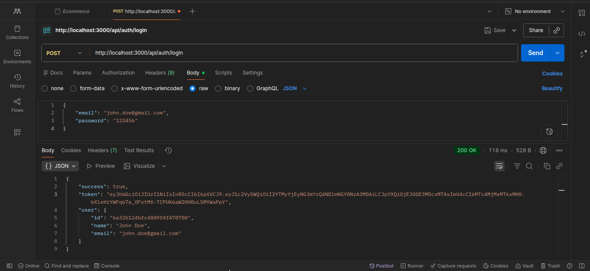
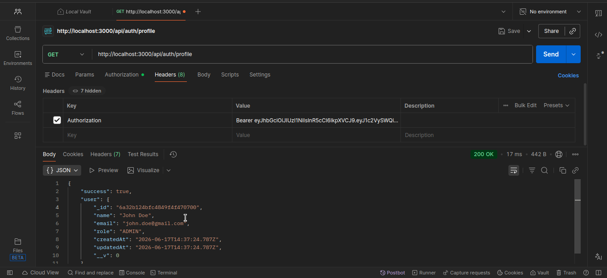
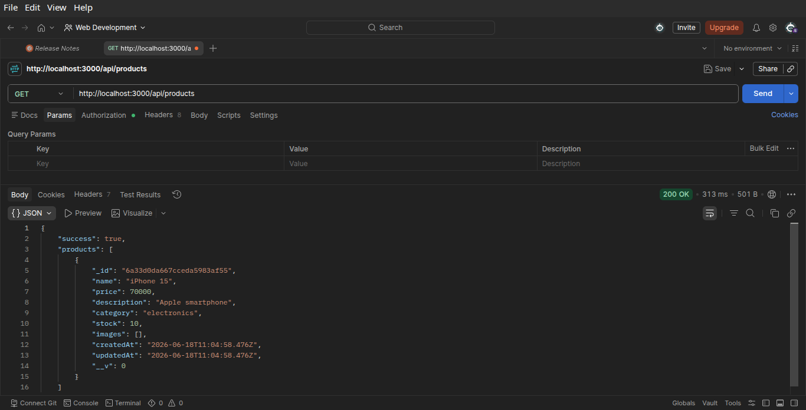
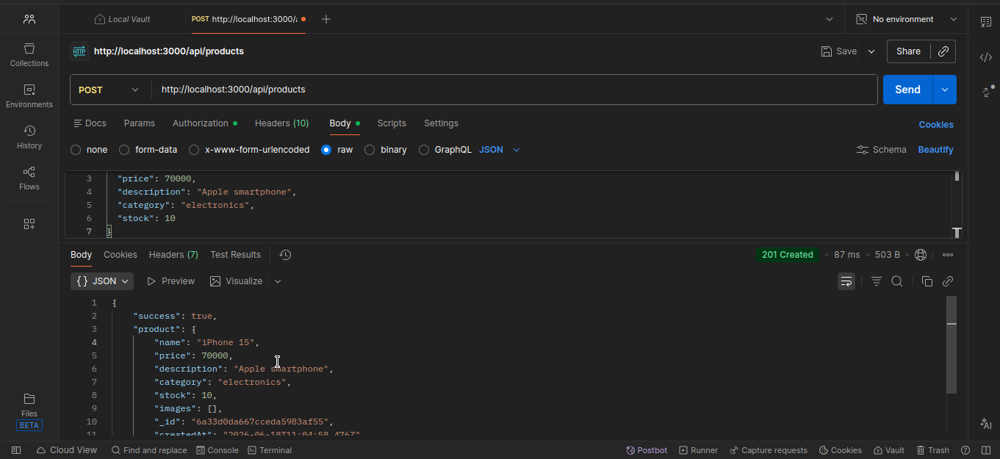
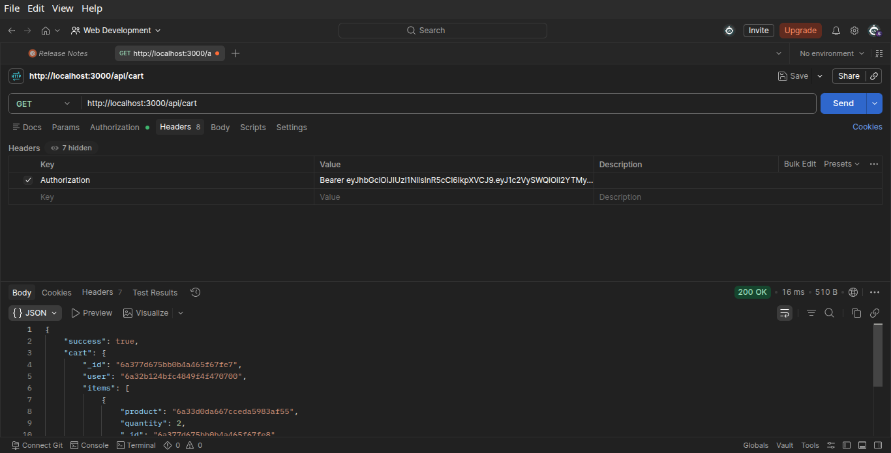
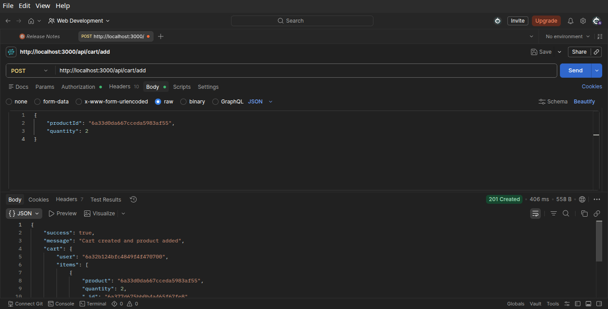
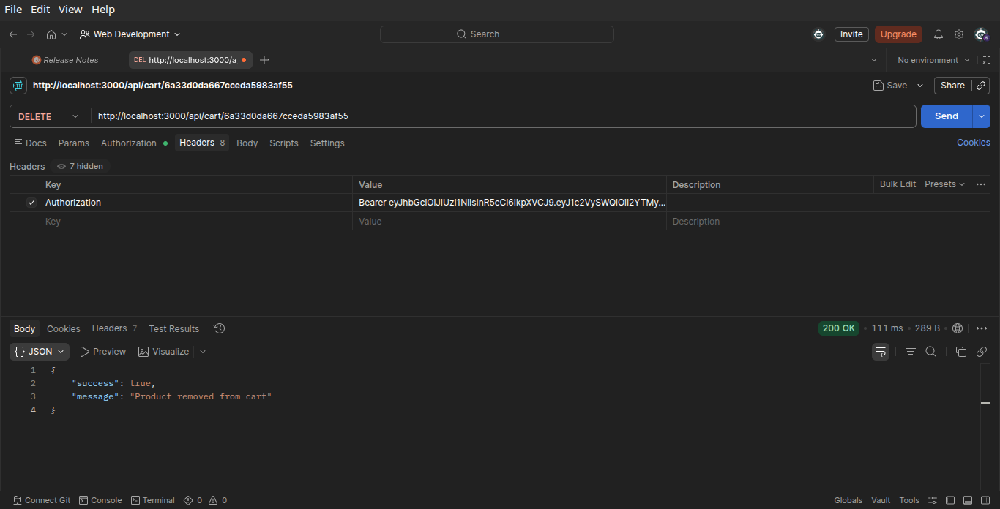

# E-Commerce Backend API

A RESTful E-Commerce Backend API built during the CodTech IT Solutions Internship. The application provides user authentication, product management, cart operations, and order processing functionalities using Node.js, Express.js, MongoDB, and JWT Authentication.

---

## Internship Details

* **Full Name:** Sumit Vitthal Desai
* **Intern ID:** CITS1120
* **Duration:** 6 Weeks
* **Project Name:** E-Commerce Backend API

---

## Project Scope

The objective of this project was to develop a scalable backend system capable of:

* Managing user authentication and authorization.
* Providing secure JWT-based login and registration.
* Implementing role-based access control (Admin/User).
* Managing products through CRUD operations.
* Handling shopping cart functionality.
* Processing customer orders.
* Designing a structured and maintainable REST API architecture.

---

## Features

### Authentication & Authorization

* User Registration
* User Login
* JWT Authentication
* JWT Authorization
* Role-Based Access Control (RBAC)
* User Profile Management

### Product Management

* Create Product
* View All Products
* View Product by ID
* Update Product
* Delete Product

### Shopping Cart

* Add Product to Cart
* View Cart
* Remove Product from Cart

### Order Management

* Place Orders
* View Order History
* Order Status Tracking
* Order Snapshot Storage

---

## Tech Stack

### Backend

* Node.js
* Express.js

### Database

* MongoDB
* Mongoose ODM

### Authentication

* JSON Web Token (JWT)
* bcrypt

### API Testing

* Postman

---

## Project Structure

```text
E-Commerce-Backend/
│
├── controllers/
│   ├── authController.js
│   ├── productController.js
│   ├── cartController.js
│   └── orderController.js
│
├── middlewares/
│   ├── authMiddleware.js
│   └── adminMiddleware.js
│
├── models/
│   ├── User.js
│   ├── Product.js
│   ├── Cart.js
│   └── Order.js
│
├── routes/
│   ├── authRoutes.js
│   ├── productRoutes.js
│   ├── cartRoutes.js
│   └── orderRoutes.js
│
├── config/
|   └── db.js
│
├── server.js
│
└── README.md
```

---

## Database Design

### User

```js
{
  name,
  email,
  password,
  role
}
```

### Product

```js
{
  name,
  price,
  description,
  category,
  stock,
  images
}
```

### Cart

```js
{
  user,
  items: [
    {
      product,
      quantity
    }
  ]
}
```

### Order

```js
{
  user,
  items: [
    {
      product,
      name,
      price,
      quantity
    }
  ],
  totalAmount,
  status
}
```

---

## Installation & Setup

### Clone Repository

```bash
git clone https://github.com/SumitDesai-21/Ecommerce-Backend-API.git
cd Ecommerce-Backend-API
```

### Install Dependencies

```bash
npm install
```

### Run Server

```bash
npm run dev
```

---

## Environment Variables

Create a `.env` file in the root directory:

```env
PORT=5000

MONGODB_URI=YOUR_MONGODB_CONNECTION_STRING

JWT_SECRET=YOUR_SECRET_KEY
```

---

## API Endpoints

### Authentication

#### Register User

```http
POST /api/auth/register
```

#### Login User

```http
POST /api/auth/login
```

#### Get Profile

```http
GET /api/auth/profile
```

---

### Products

#### Create Product

```http
POST /api/products
```

#### Get All Products

```http
GET /api/products
```

#### Get Product By ID

```http
GET /api/products/:id
```

#### Update Product

```http
PUT /api/products/:id
```

#### Delete Product

```http
DELETE /api/products/:id
```

---

### Cart

#### Add To Cart

```http
POST /api/cart/add
```

Request Body:

```json
{
  "productId": "PRODUCT_ID",
  "quantity": 2
}
```

#### View Cart

```http
GET /api/cart
```

#### Remove Item From Cart

```http
DELETE /api/cart/:productId
```

---

### Orders

#### Place Order

```http
POST /api/orders
```

#### Get User Orders

```http
GET /api/orders
```

---

## Workflow

1. User registers and logs into the application.
2. JWT token is generated upon successful login.
3. Users browse available products.
4. Products can be added to the shopping cart.
5. Users review their cart contents.
6. Orders are created from cart items.
7. Product details are stored as order snapshots.
8. Order history can be viewed by authenticated users.

---

## Key Concepts Implemented

* REST API Design
* JWT Authentication
* Role-Based Authorization
* Password Hashing with bcrypt
* MongoDB Relationships
* Middleware Architecture
* CRUD Operations
* Cart & Order Management
* Order Snapshot Pattern
* Error Handling

---

## Output Images

### User - register/login





### Profile Information



### Products





### Carts







---

## Author

**Sumit Vitthal Desai**
Intern ID: CITS1120
